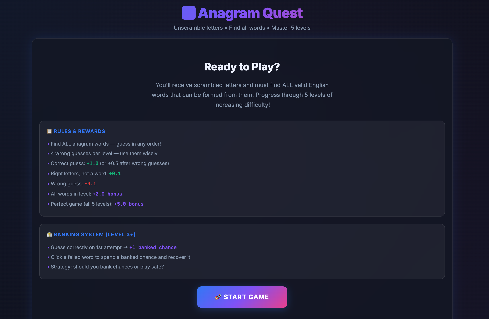
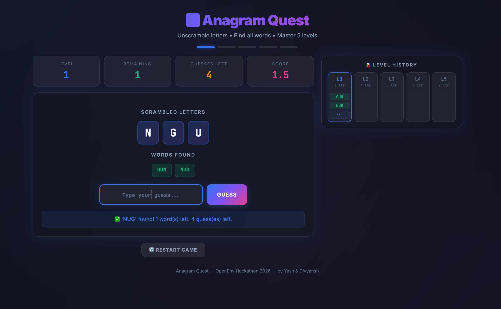

# 🔤 Anagram Quest — Word Guessing Environment

An RL-ready anagram word-guessing environment with 5 progressive difficulty levels, a strategic banking system, and dense reward shaping. Built with the [OpenEnv](https://github.com/openenv) framework.

> This repository is **Part 1 (Environment Foundation)** of the larger Anagram Quest system.
>
> Master repository (full architecture + journey): **[divyanshailani/anagram-quest](https://github.com/divyanshailani/anagram-quest)**

<p align="center">
  <a href="https://ailanidivyansh-word-guessing-env.hf.space/web"><b>🎮 Play Live on Hugging Face</b></a>
</p>

## Screenshots

<p align="center">
  
</p>
<p align="center"><em>Welcome screen with rules and banking system overview</em></p>

<p align="center">
  
</p>
<p align="center"><em>Gameplay — Level 1: unscramble N-G-U, 2 words found, level history tracker on the right</em></p>

## Game Overview

| Feature | Details |
|---------|---------|
| **Levels** | 5 levels (3→7 letter words) |
| **Objective** | Unscramble letters to find ALL valid anagram words |
| **Attempts** | Dynamic per level: `2 × total words in level` |
| **Banking** | Level 3+: a perfect opening guess can trigger a bank choice (`preserve` or `current`) |
| **Auto-progression** | Advances to next level when all words found or attempts exhausted |

## Reward System

| Event | Reward |
|-------|--------|
| First correct guess of a level with no prior mistakes | **+1.0** |
| Any other valid, unfound anagram | **+0.5** |
| Close guess (right letters, wrong word) | **+0.1** |
| Wrong guess | **-0.1** |
| All words in level found | **+2.0 bonus** |
| Perfect game (all 5 levels, no failures) | **+5.0 bonus** |
| Recovered word via bank | **+0.5** |

## Quick Start

### 🎮 Play in Browser

**[→ Play Anagram Quest Live](https://ailanidivyansh-word-guessing-env.hf.space/web)** — no install needed, runs directly in your browser.

### 🤖 Use as RL Environment

```python
from word_guessing_env import WordGuessingAction, WordGuessingEnv

with WordGuessingEnv(base_url="https://ailanidivyansh-word-guessing-env.hf.space") as env:
    result = env.reset()
    print(f"Level {result.observation.current_level}")
    print(f"Letters: {result.observation.scrambled_letters}")

    # Guess a word
    result = env.step(WordGuessingAction(word_guess="CARS"))
    print(f"Reward: {result.reward}")

    # Spend a banked chance on a failed LEVEL (Level 3+)
    result = env.step(WordGuessingAction(use_bank_on="3"))
```

### 🏠 Run Locally

```bash
# Install dependencies
uv sync

# Start the server
uv run uvicorn server.app:app --host 0.0.0.0 --port 8000

# Open http://localhost:8000/play in your browser
```

## Action Space

The agent can perform four action types:

```python
# Guess a word
WordGuessingAction(word_guess="CARS")

# Spend a banked chance to start recovery on a failed level (Level 3+)
WordGuessingAction(use_bank_on="3")

# Resolve a bank choice or spend action
WordGuessingAction(bank_decision="preserve")  # or "current", "boost_current", "cancel_recovery"

# Submit a recovery challenge guess
WordGuessingAction(recovery_guess="SCAR")
```

## Observation Space

Each observation contains:
- `scrambled_letters`: List of letters to unscramble
- `words_found`: Words successfully guessed so far
- `words_remaining`: How many words are left to find
- `current_level`: Current level (1-5)
- `attempts_left_for_word`: Remaining guess budget in the current level
- `banked_chances`: Available banked chances
- `failed_words`: Redacted failed entries recoverable via bank (e.g., `??? (L3)`)
- `message`: Human-readable feedback
- `reward`: Reward for this action
- `done`: Whether the game is over

## Project Structure

```
anagram-quest-openenv/
├── README.md
├── openenv.yaml           # OpenEnv manifest
├── pyproject.toml         # Dependencies
├── models.py              # Action & Observation Pydantic models
├── client.py              # WordGuessingEnv client
├── docs/
│   ├── welcome.png        # Welcome screen screenshot
│   └── gameplay.png       # Gameplay screenshot
├── static/
│   └── index.html         # Interactive game UI
└── server/
    ├── word_guessing_env_environment.py  # Core game logic
    ├── app.py             # FastAPI server + game API
    └── Dockerfile         # Container image
```

## API Endpoints

| Endpoint | Method | Description |
|----------|--------|-------------|
| `/play` | GET | Interactive game UI |
| `/api/reset` | POST | Reset game (stateful) |
| `/api/step` | POST | Submit guess (stateful) |
| `/reset` | POST | OpenEnv reset (stateless) |
| `/step` | POST | OpenEnv step (stateless) |
| `/ws` | WS | WebSocket for persistent sessions |
| `/docs` | GET | Swagger API docs |
| `/health` | GET | Health check |

## Tech Stack

- **Backend**: FastAPI + uvicorn
- **Environment**: OpenEnv framework (compatible with RL agents)
- **Frontend**: Vanilla HTML/CSS/JS with glassmorphism dark UI
- **Deployment**: Docker → Hugging Face Spaces
- **Game Data**: 95+ curated anagram word groups across 5 difficulty levels

## Team

Built by **Yash & Divyansh**

## Contributors

- [Divyansh Ailani](https://github.com/divyanshailani)
- [Yash Bajpai](https://github.com/Yash1bajpai)
